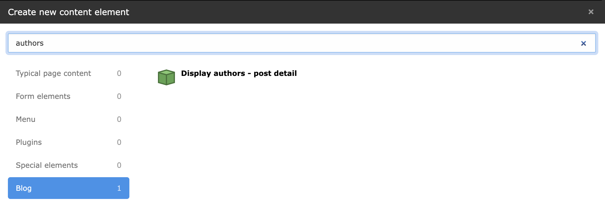

# TYPO3 Extension Blog Authors

The plugin allows you to display information about the authors of post in a single view.

## Installation 

```bash
composer req drblitz/blog-author
```

Displaying information about the author/authors can be done in two ways.

You can either add a new plugin to the page:




or you can also call it as a Typoscript object:

`
<f:cObject typoscriptObjectPath="lib.post_authors" />
`
